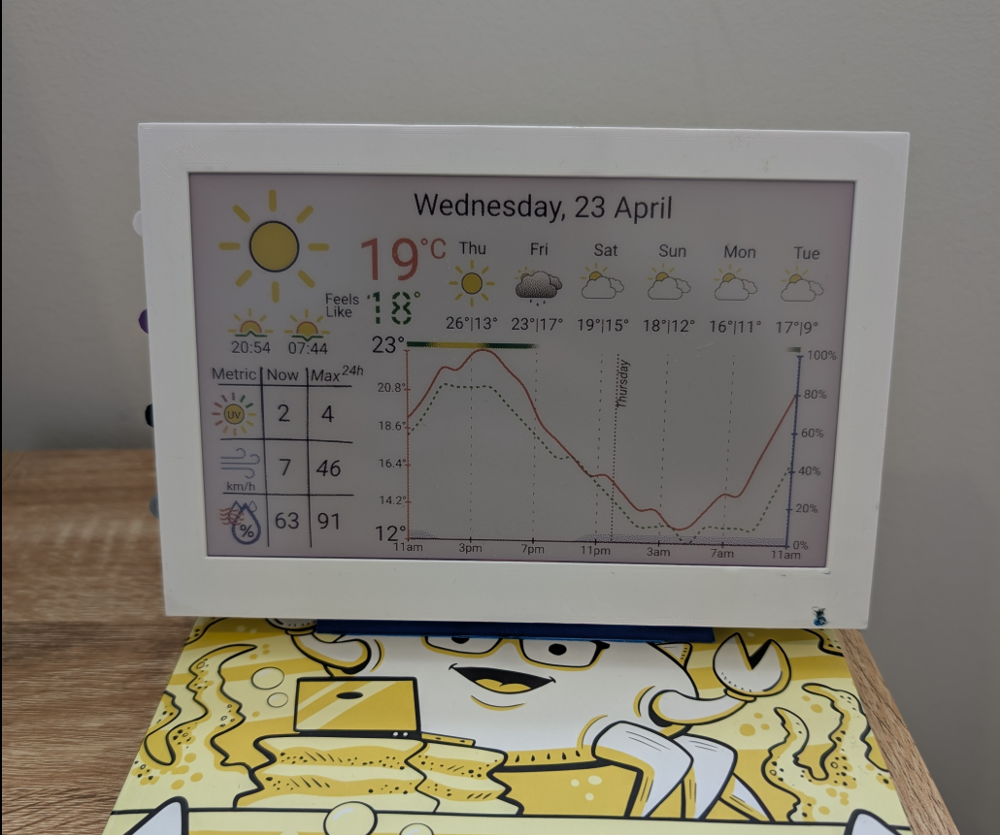
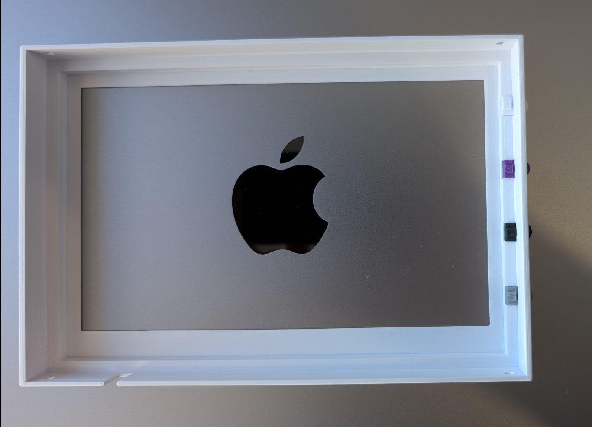
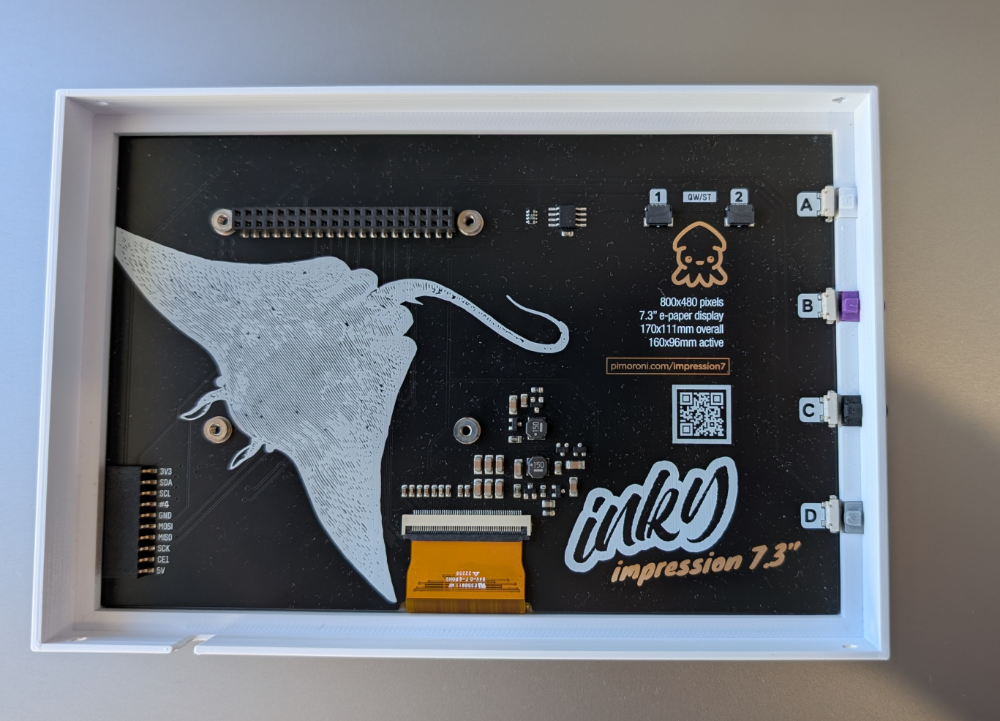
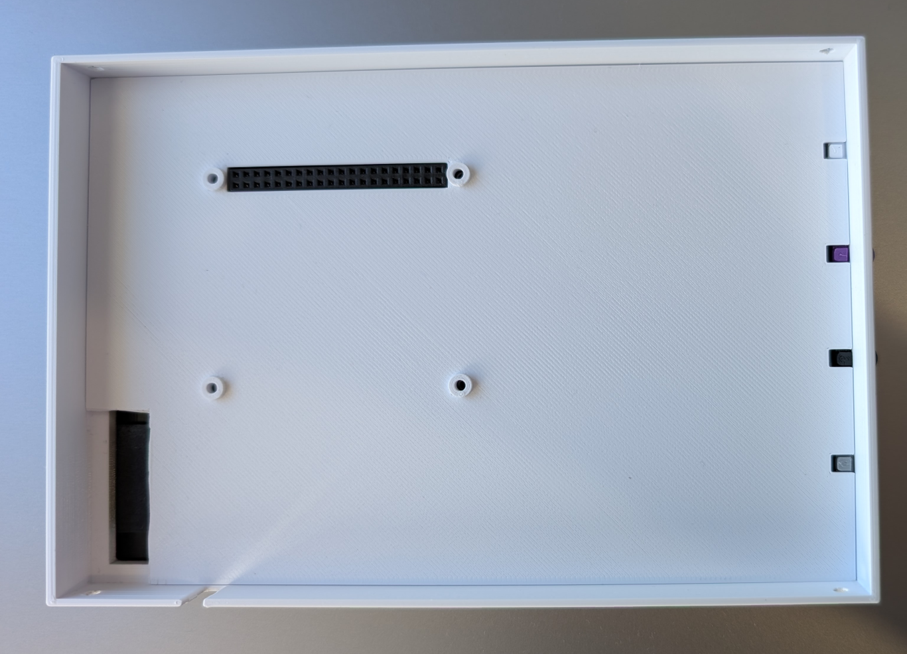
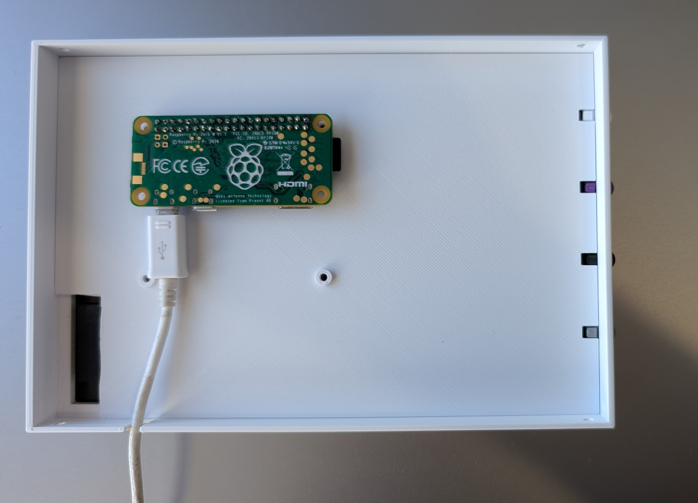
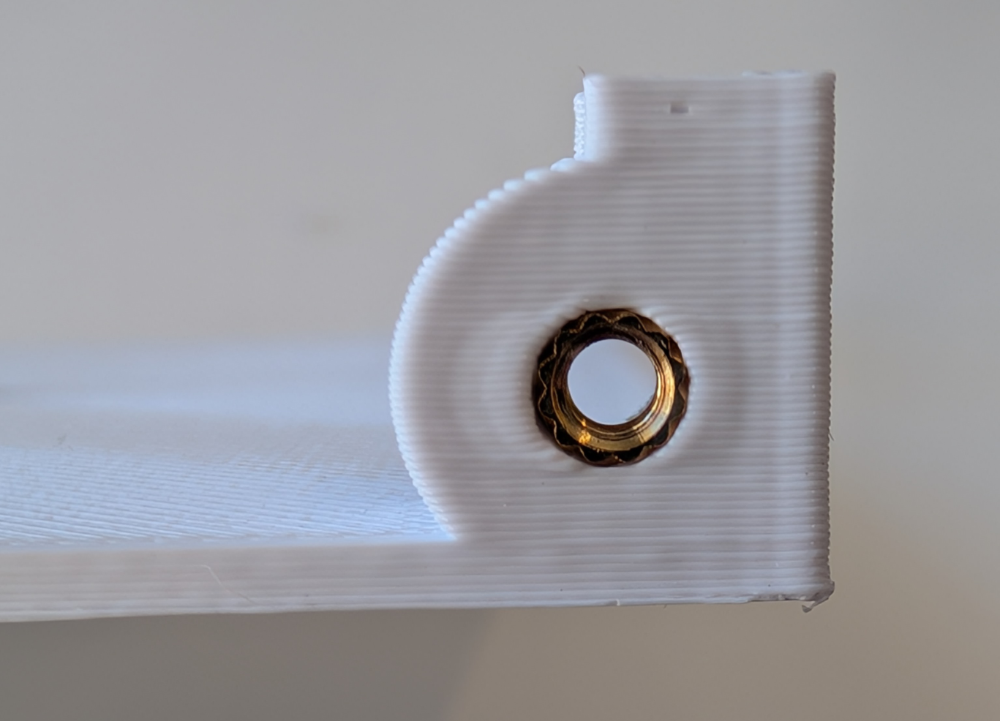
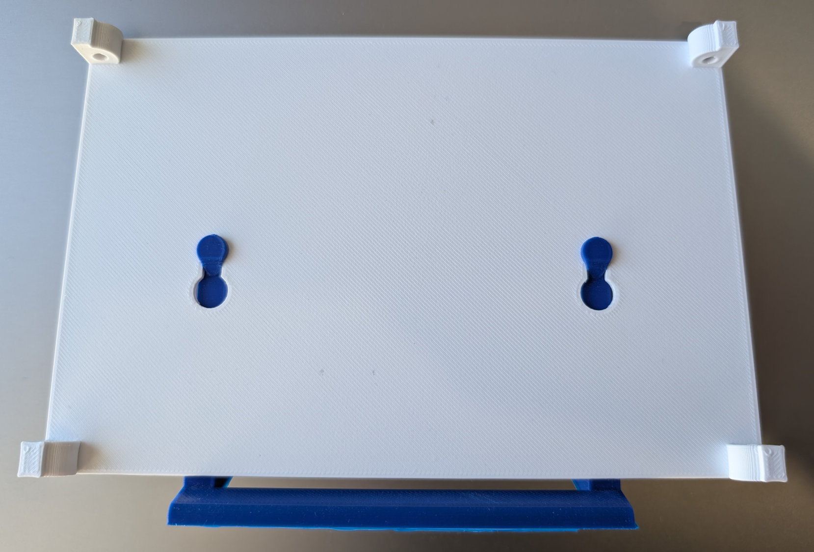
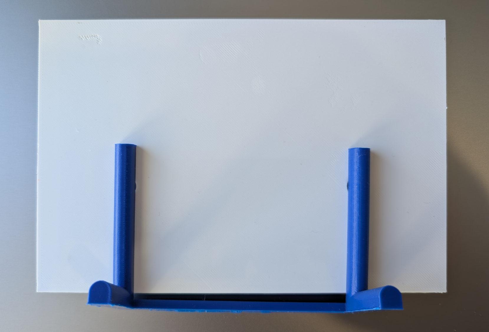

# Inky Impression 7.3" (7 colour ePaper/E Ink HAT) Case

This case is a modified version of [inky impression case](https://github.com/scripsi/inky-impression-case) that is designed to fit the [Pimoroni Inky Impression](https://shop.pimoroni.com/products/inky-impression) 7-colour e-ink display. It is designed to be wall-mounted or used as a desk stand.

The weather dashboard code and installation can be found [here](https://github.com/mt-empty/pi-inky-weather-epd)

## Required Parts

### 3D Printed Parts
* inky-impression-case-frame.stl
* inky-impression-case-backplane.stl
* 4 x inky-impression-case-button.stl
* inky-impression-case-rearpanel.stl (with inserts) OR inky-impression-case-rearpanel-no-inserts.stl (without inserts)
* [OPTIONAL] inky-impression-case-stand.stl - clips into the keyholes on the rear panel

### Hardware
* 4 x M2.5 threaded inserts - brass heat-set type, external diameter 3.5mm, length 4-6mm
OR
* 4 x M2.5 countersunk bolts, 6mm long (without inserts)

AND maybe:
* 4 x M2.5 bolts, 6mm long (you can use the ones supplied with the Inky Impression), I didn't have to use them as the backplane was held in place by the rear panel and the frame.

## Printing Specifications
The design is optimised for the Engineering profile of Ultimaker Cura s3, 0.15mm nozzle and 0.15mm layer height with default 20% infill.

## Construction

The instructions are similar to the [original case](https://github.com/scripsi/inky-impression-case):

1. Test that the backplane fits right down into the frame to rest on the ledges around the top and sides. It should be a really snug fit - sandpaper the edges of the backplane a bit if it won't go in on the first try!

2. Lay the frame face down on a work surface and slide the four buttons into the slots in the side, with the rectangular lugs on each button facing towards you.

3. Mount the backplane to the Inky Impression using the M2.5 bolts that are supplied with the display, I didn't use screws as I found the backplane was held in place by the rear panel and the frame.

4. Gently slide the Inky Impression on its backplane into the frame, with the screen facing down and the slots for the buttons on the correct side.

5. Carefully press the Raspberry Pi Zero onto the header on the Inky Impression so that it is held firmly in place. Attach a Micro USB cable to the connector nearest the corner of the Pi and lead the cable through the slot in the bottom of the frame.

6. [Heat-set the inserts](https://markforged.com/resources/blog/heat-set-inserts) (if using) into the mounts on the rear panel.

7. [Optional] Attach the stand to the rear panel by sliding it into the keyholes. Ensure the stand is securely attached by gently pressing it down until it clicks or feels firmly in place. The stand is optional, and you can use the case without it.

8. Place the rear panel into the frame. The pads on the rear panel mounts should hold the backplane in place within the case. Use the M2.5 countersunk bolts to secure the rear panel to the case.

9. [Optional] To wall-mount, place two screws on the wall, 100mm apart and horizontally in line with where you want the centre of the screen, then slot the keyholes in the rear panel onto the screws.
